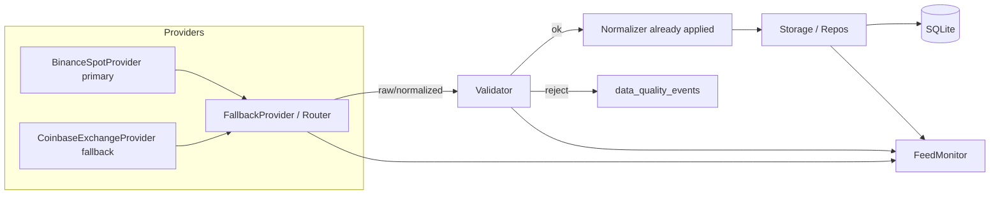

# Phase 2 — Data Engine

**Scope:** public market data only.  
**Pipeline:** `RECEIVE → VALIDATE → NORMALIZE → STORE → MONITOR`  
**Not in Phase 2:** strategies, signals, backtesting, paper trading, order execution, leverage, money management, API keys.

---

## Sources researched

| Source | Role | Auth | Notes |
|--------|------|------|-------|
| **Binance Spot** | **Primary** | None for market data | Deepest BTC/ETH USDT liquidity; official REST+WS; dedicated data-only hosts |
| **Coinbase Exchange** | **Fallback** | None for public feed | Regulated venue; high-quality public REST/WS; **USD** pairs (≠ USDT) |
| Kraken | Future option only | — | Not implemented in Phase 2 |

### Why Binance primary
- Official, comprehensive REST + WebSocket market data
- Dedicated market-data hosts (`data-api.binance.vision` / `data-stream.binance.vision`) — no trading API surface required
- Native `BTCUSDT` / `ETHUSDT` spot symbols
- Well-documented rate limits and weight headers

### Why Coinbase fallback
- Official public Exchange API + WS feed
- Strong operational quality / regulated venue
- Used for failover and cross-check — **USD ≠ USDT** (secondary, not identical market)

### Symbol identity (venue-native — no cross-venue equality)

Every record keeps separate fields:

| Field | Meaning | Examples |
|-------|---------|----------|
| `source` | Venue | `binance`, `coinbase` |
| `symbol` / `source_symbol` | Venue-native market id | `BTCUSDT`, `BTC-USD` |
| `base_asset` / `quote_asset` | Pair legs | `BTC`+`USDT`, `BTC`+`USD` |
| `canonical_asset` | Asset-level **only** (for later comparison) | `BTC`, `ETH` |

**Critical:** Coinbase `BTC-USD` is **never** stored as `BTCUSDT`. USD ≠ USDT; venues are separate markets.  
Settings may list `BTCUSDT,ETHUSDT`; Binance uses those natively; Coinbase translates to `BTC-USD`/`ETH-USD` **for API calls only**, then stores the native Coinbase product id.

---

## Endpoints (public, no key)

### Binance
- REST preferred: `https://data-api.binance.vision` (fallback host `https://api.binance.com`)
  - `/api/v3/klines`, `/api/v3/trades`, `/api/v3/ticker/bookTicker`, `/api/v3/ticker/24hr`, `/api/v3/time`
- WS: `wss://data-stream.binance.vision` — `@kline_1m`, `@trade`, `@bookTicker`
- Rate limits: ~1200 REQUEST_WEIGHT/min/IP; klines weight ~2; respect **429** + `Retry-After`; watch `X-MBX-USED-WEIGHT-*`

### Coinbase Exchange
- REST: `https://api.exchange.coinbase.com` — candles, ticker, trades, time
- WS: `wss://ws-feed.exchange.coinbase.com` — `ticker`, `matches`
- Public REST ~10 rps/IP (burst ~15)

---

## REST vs WebSocket

| Use | Transport |
|-----|-----------|
| Realtime ticker / trades / bookTicker / live kline updates | **WebSocket** |
| Backfill, snapshots, reconnect catch-up, WS failure | **REST** |

Never use future information: reject `event_time > received_at + skew`.

---

## EVENT TIME vs RECEIVED TIME

| Field | Meaning |
|-------|---------|
| `event_time` | Exchange-reported event timestamp (UTC) |
| `received_at` | Local UTC when this process received the payload |
| `ts` (OHLCV) | Mirrors `event_time` (Phase 1 compatibility) |
| `created_at` | DB insert time |

The Data Engine **stores or rejects** — it does not trade on future or stale data.

---

## Architecture



ASCII:

```
  Binance (primary) ──┐
                      ├── FallbackProvider ──► validate ──► store ──► SQLite
  Coinbase (fallback)─┘         │                │
                                └── FeedMonitor ◄─┘
```

Package layout: `crypto_lab/data/` (+ `providers/`).

---

## Schema changes (additive)

1. `market_data`: add `event_time`, `received_at`, `source_symbol`, `base_asset`, `quote_asset`, `canonical_asset`; unique → `(source, symbol, ts, timeframe)` (symbol is venue-native)
2. New: `market_trades`, `market_quotes`, `data_quality_events` (with the same identity columns)
3. Applied by `init_db()` / `apply_phase2_migrations()` — see `crypto_lab/data/migrations/`

---

## Validations

- future timestamps, delayed/lagging, out-of-order, duplicates, missing candles/gaps
- stale data, negative/impossible prices, invalid OHLC, invalid volume
- bid > ask, abnormal spread, inconsistent timestamps, clock skew vs `/time`, invalid symbol

---

## How to run

```bash
source .venv/bin/activate
pip install -e ".[dev]"
crypto-lab init-db
crypto-lab data fetch-rest --limit 5
crypto-lab data validate-sample
crypto-lab data health --ping --json
pytest -v
RUN_LIVE_DATA_TESTS=1 pytest -v -m live
```

Defaults remain `MODE=PAPER`, `LIVE_TRADING=False`.

---

## What is NOT in Phase 2

- Strategies / signals / indicators for trading decisions
- Backtesting engine
- Paper broker / order simulation
- Live order execution / account endpoints
- API keys or secrets
- Leverage / money management
